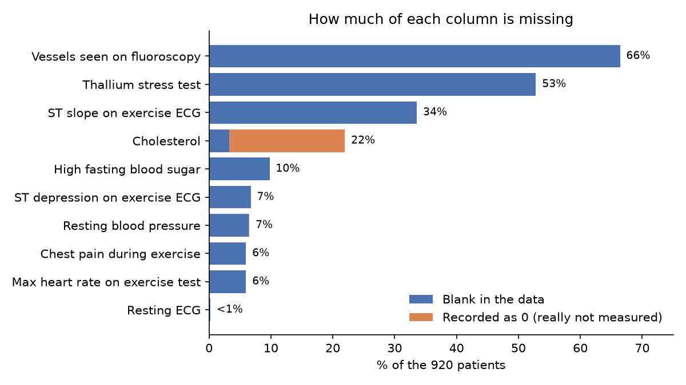
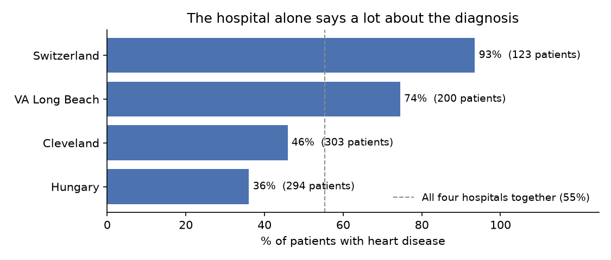
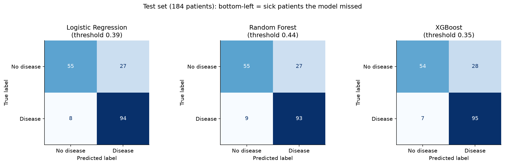
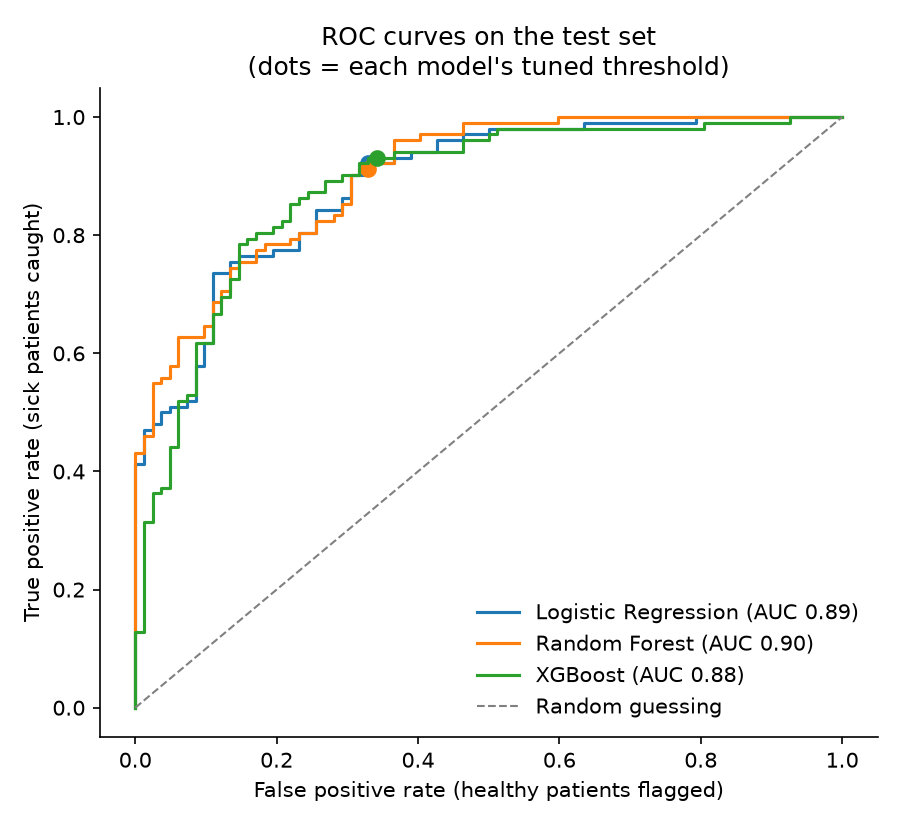
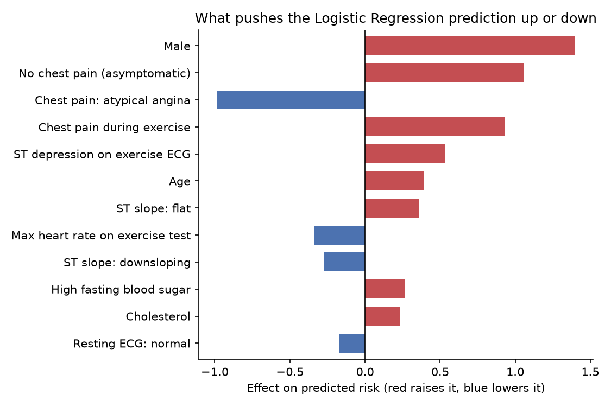

# Heart disease risk screen

A machine learning model that estimates whether a patient has heart disease from routine clinical
measurements: age, blood pressure, cholesterol, chest pain type, and an exercise ECG. I compared
logistic regression, random forest and XGBoost on 920 patients from four hospitals, tuned the model
so it misses as few sick patients as possible, and put it behind a small Streamlit app.

The question I kept coming back to: **if this were used for screening, which mistake is worse?**
Telling a sick patient they're fine is worse than a false alarm, because a false alarm just
means a follow-up test. So I didn't optimise for accuracy. I set the model up to catch at least 90%
of sick patients and then measured how many false alarms that costs.

## What I found in the data

Before modelling anything I spent time just looking at the dataset, and it was messier than I
expected.



- **Two columns are mostly empty.** `ca` (blood vessels seen on fluoroscopy) is missing for 66% of
  patients and `thal` (thallium stress test) for 53%. Both come from expensive tests that only the
  Cleveland hospital ran on most patients. Filling in two thirds of a column would mean inventing
  the data, so I dropped both.
- **Some missing values were hiding as zeros.** 172 patients have a cholesterol of exactly 0, which
  isn't possible for a living person. Someone entered 0 for "not measured." `isna()` doesn't catch
  these, so cholesterol looks 3% missing but is really 22% missing. I convert them to proper
  missing values before training.



- **The hospital is a shortcut the model shouldn't take.** 93% of the Swiss patients have heart
  disease, compared with 36% in Hungary. If the model could see which hospital a patient came from,
  it would lean on that instead of the patient's actual measurements, and a new patient doesn't
  come from any of these four hospitals anyway. So the `dataset` column is dropped.

## Results

The data was split once, 80/20, at the start. All tuning happened with 5-fold cross-validation on
the 736 training patients. The 184 test patients were only used once, at the very end, for the
numbers below.

| Model | Threshold | Accuracy | Precision | Recall | ROC-AUC | Sick patients missed | False alarms |
|---|---|---|---|---|---|---|---|
| Logistic Regression | 0.50 | 0.79 | 0.80 | 0.84 | 0.89 | 16 | 22 |
| **Logistic Regression** | **0.39** | **0.81** | **0.78** | **0.92** | **0.89** | **8** | **27** |
| Random Forest | 0.50 | 0.79 | 0.78 | 0.87 | 0.90 | 13 | 25 |
| Random Forest | 0.44 | 0.80 | 0.78 | 0.91 | 0.90 | 9 | 27 |
| XGBoost | 0.50 | 0.81 | 0.80 | 0.87 | 0.88 | 13 | 22 |
| XGBoost | 0.35 | 0.81 | 0.77 | 0.93 | 0.88 | 7 | 28 |



What I took away from this:

- **Lowering the threshold mattered more than the choice of model.** For logistic regression,
  moving the cut-off from 0.50 to 0.39 halved the number of missed sick patients (16 to 8) and
  added only 5 false alarms.
- **The fancy models didn't buy much.** All three land within a couple of points of each other.
  On 920 patients there just isn't enough data for random forest or XGBoost to pull ahead, and
  logistic regression is much easier to explain.
- **I picked the final model before looking at the test set.** The rule was: among the models tuned
  to 90% recall in cross-validation, take the one with the fewest false alarms. Logistic regression
  won. XGBoost happens to miss one fewer patient on the test set, but switching to it *because* of
  the test set would make the test set useless as an honest check.



## What the model pays attention to



Being male, chest pain during exercise, and ST depression on the exercise ECG all push the risk up,
which matches what I read about heart disease. The one that surprised me was **"no chest pain
(asymptomatic)"** being one of the strongest risk signals. These patients were all referred for an
angiogram, so someone with no chest pain who still got referred probably had other warning signs.
It's a good reminder that the model learns patterns in *this* group of patients, not medical truth.

## How it handles missing values without cheating

Missing values are filled in (median for numbers, most common value for categories) and features
are scaled inside a scikit-learn `Pipeline`. That way the fill-in values are learned from the
training data only. If I had filled them in using the whole dataset first, a little information
about the test patients would leak into training and the results would look better than they
really are.

## Run it yourself

```bash
python -m venv .venv
source .venv/bin/activate          # Windows: .venv\Scripts\activate
pip install -r requirements.txt

python data/download_data.py       # downloads the UCI data into data/
python -m src.explore              # data report + the two data charts
python -m src.train                # trains and compares the models, saves plots and the final model
streamlit run app.py               # opens the app in your browser
```

```
data/download_data.py   downloads the four UCI hospital files and combines them
src/data.py             loading, cleaning, feature lists, preprocessing pipeline
src/explore.py          missing values, hidden zeros, disease rate by hospital
src/train.py            model comparison, threshold tuning, plots, saves the final model
app.py                  Streamlit app
reports/                charts and the results table
models/                 the saved model
```

## Limitations

- The data is from 1981 to 1988, and every patient had already been referred for an angiogram.
  That's not the general population, so the model would likely over-predict disease for, say, a
  healthy 30-year-old.
- 184 test patients is a small test set. Each number in the table could easily move a few
  percentage points with a different split.
- Not a medical device, and not medical advice.

## Data

Janosi, A., Steinbrunn, W., Pfisterer, M., & Detrano, R. (1988). Heart Disease [Dataset].
UCI Machine Learning Repository. https://doi.org/10.24432/C52P4X
